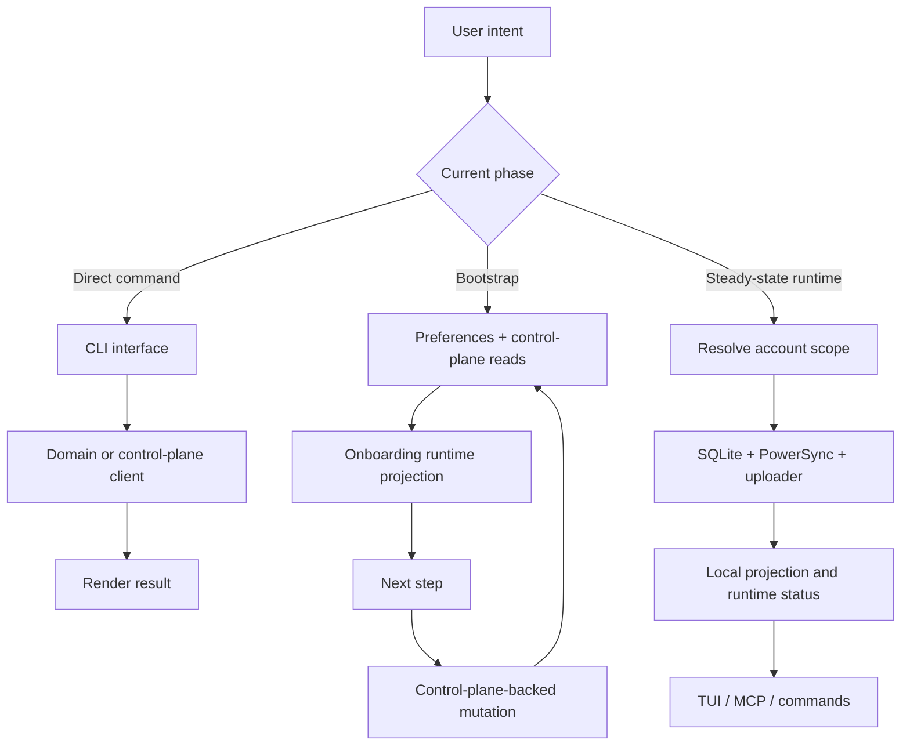

# Data Flow

This CLI intentionally uses different data flows at different phases of the
session. If you miss that phase split, the code can look inconsistent. Once you
see it, the behavior is straightforward.

## Start with the rule

Remote control-plane state is authoritative.

Local state exists to make the CLI responsive and to support long-running
runtime behavior. It is not a competing source of product truth.

Everything else in this repository follows from that rule.

## There are three practical flows

When engineers talk about "data flow" here, they usually mean one of three
things:

1. direct command flow,
2. onboarding bootstrap flow,
3. steady-state runtime flow.

Those flows use different paths on purpose.

## Flow 1: direct command flow

For plain CLI commands, the flow is direct:

parse input -> call service/client boundary -> render result

This path does not need a local projection to be correct. The command surface
is an adapter over domain and infrastructure boundaries.

Relevant code starts in:

- [`internal/interfaces/cli`](../../internal/interfaces/cli)
- [`internal/domains`](../../internal/domains)
- [`internal/infrastructure/controlplane/api`](../../internal/infrastructure/controlplane/api)

## Flow 2: onboarding bootstrap flow

Before account-scoped runtime exists, the app cannot rely on a running local
projection. So onboarding is API-first and state-driven.

The flow is:

1. load persisted preferences,
2. query control-plane state needed for bootstrap,
3. project the current onboarding state,
4. derive the next step from that state,
5. perform mutations through domain/runtime methods,
6. re-project state and route again.

The important property is determinism. The TUI does not guess the next step
from local widget state. Runtime state is the source of truth for progression.

Relevant code:

- [`internal/runtime/onboarding`](../../internal/runtime/onboarding)
- [`internal/domains/preferences`](../../internal/domains/preferences)
- [`internal/domains/tenancy`](../../internal/domains/tenancy)
- [`internal/domains/integrations`](../../internal/domains/integrations)
- [`internal/interfaces/tui/screens/onboarding`](../../internal/interfaces/tui/screens/onboarding)

### Bootstrap failure behavior

Bootstrap is intentionally projection-driven. When a remote mutation succeeds,
the app should re-read and re-project state instead of assuming the next step
from local form state.

If onboarding feels flaky, the usual bug is one of:

- stale preferences,
- a control-plane contract mismatch,
- deriving progression from widget state instead of runtime state.

## Flow 3: steady-state runtime flow

Once bootstrap is complete, the app becomes account-scoped and long-running.

The flow is:

1. resolve account-scoped preferences and scope,
2. open the local SQLite database for that account,
3. start PowerSync against the scoped account,
4. start the uploader against the local CRUD queue,
5. read runtime status and local projection data from local services,
6. keep local and remote state converging over time.

Relevant code:

- [`internal/runtime/session`](../../internal/runtime/session)
- [`internal/infrastructure/sqlite`](../../internal/infrastructure/sqlite)
- [`internal/infrastructure/powersync`](../../internal/infrastructure/powersync)

### Steady-state failure behavior

Steady-state runtime is allowed to be eventually consistent, but it must still
be scope-correct and monotonic:

- runtime should reconnect or resubscribe rather than silently stall,
- uploader failures should not silently drop mutations,
- scope changes should rebuild account-scoped runtime instead of mutating a
  shared global client in place.

## How mutation flow works

Mutations are not random ad hoc writes.

At the domain level, user intent is validated through typed input structs.
Those operations then flow through runtime orchestration or infrastructure
clients, depending on the phase.

Broadly:

- bootstrap mutations go straight to control-plane-backed domain services,
- steady-state local mutations should flow through the local mutation pipeline
  and uploader where appropriate.

If a new mutation bypasses the intended pipeline, the repo becomes harder to
reason about and sync correctness becomes brittle.

## Why scope is explicit everywhere

Multi-tenant correctness depends on scope discipline.

Organization, account, and workspace scope are explicit in preferences, runtime
state, and service calls because hidden mutable global scope is how long-lived
terminal sessions leak data across tenants.

This is why the app restarts or re-resolves scoped runtime state when scope
changes, rather than mutating some shared global client in place.

## Where engineers usually make mistakes

The repeated failures in this area are predictable:

- treating local storage as authority instead of projection,
- writing bootstrap code that assumes runtime already exists,
- hiding scope in mutable shared state,
- bypassing the intended mutation path,
- letting the UI infer truth from local widget state instead of runtime/domain
  state.

If you keep the three flows explicit, most of those mistakes disappear.

## Fast code entry points

- [`internal/interfaces/cli`](../../internal/interfaces/cli)
- [`internal/runtime/onboarding`](../../internal/runtime/onboarding)
- [`internal/runtime/session`](../../internal/runtime/session)
- [`internal/infrastructure/controlplane/api`](../../internal/infrastructure/controlplane/api)
- [`internal/infrastructure/powersync`](../../internal/infrastructure/powersync)
