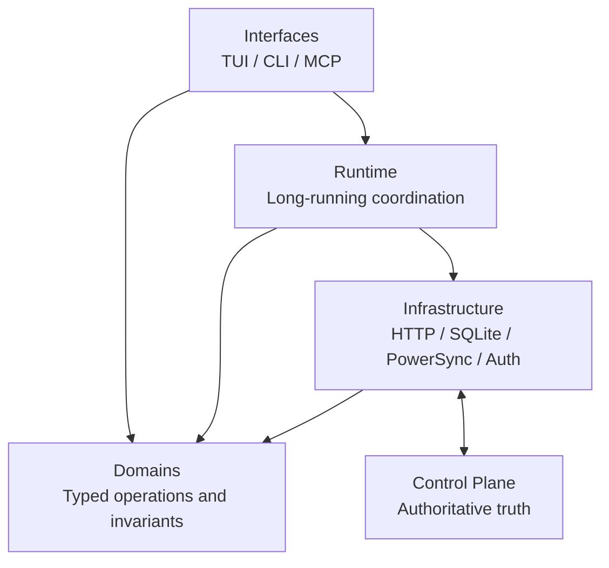

# System Overview

The CLI is the presentation runtime for Tero. It is not the product authority.
That distinction is the most important mental model in this repository.

The control plane owns business rules and authoritative state transitions. This
codebase owns terminal UX, local runtime orchestration, and responsive behavior
on top of control-plane and sync-backed state.

## What this executable exposes

One executable starts user-facing surfaces from [`cmd/tero/main.go`](../../cmd/tero/main.go):

- the interactive TUI through [`internal/interfaces/tui`](../../internal/interfaces/tui),
- direct command surfaces through [`internal/interfaces/cli`](../../internal/interfaces/cli),
- an MCP surface through [`internal/interfaces/mcp`](../../internal/interfaces/mcp).

Composition happens at the top. Interface packages start surfaces, but they do
not invent their own product logic.

## The core layer model

The rebuilt app is easiest to understand as four layers:

1. `internal/domains`
   Domain types, validation, and service contracts. This is where invariants
   and business-shaped operations live.
2. `internal/infrastructure`
   Concrete adapters for HTTP, SQLite, PowerSync, WorkOS, preferences, and
   logging. These are focused libraries, not orchestrators.
3. `internal/runtime`
   Long-running orchestration and state machines. Runtime packages coordinate
   domain services and infrastructure over time.
4. `internal/interfaces`
   User-facing surfaces. These packages translate UI and command intent into
   runtime or domain calls and render results.

If a change does not fit one of those four roles, stop and re-evaluate the
boundary before writing code.

## What each layer must not do

`domains` must not depend on UI or concrete infrastructure.

`infrastructure` must not become product policy. It should implement contracts,
not decide workflow semantics.

`runtime` must not render or know about terminal chrome. It owns lifecycle and
state progression only.

`interfaces` must not become a second policy engine. They should compose,
translate, route, and render.

## How the app actually starts

The entry flow is:

1. [`cmd/tero/main.go`](../../cmd/tero/main.go) calls the CLI entrypoint.
2. [`internal/interfaces/cli/execute.go`](../../internal/interfaces/cli/execute.go)
   resolves config, logging, and the selected surface.
3. The selected surface composes dependencies from domain, infrastructure, and
   runtime packages.
4. The surface runs its own event loop or command pipeline.

That means the app does not have one giant "application" package anymore. The
composition root is still top-level, but the system is intentionally split by
layer and surface.

## Where truth lives

Authoritative truth remains remote.

Local state exists for three reasons:

- fast reads,
- responsive terminal UX,
- long-running sync/runtime behavior.

Onboarding is the deliberate exception. Before account-scoped runtime is ready,
it uses control-plane APIs directly. After bootstrap, runtime services and
local projection take over.

## The architectural split that matters most

There are two different application phases:

1. bootstrap
   API-first, deterministic, building enough scoped state to start runtime.
2. steady-state runtime
   account-scoped, long-running, sync-backed, and ready for the main product
   surface.

Most confusion in this repo comes from blurring those phases. If a flow needs a
running sync/runtime session, it does not belong in bootstrap logic. If a flow
must work before runtime exists, it should not depend on local projection.

## What breaks when this model drifts

These failures are predictable:

- business rules leak into interfaces and become inconsistent across surfaces,
- infrastructure starts coordinating workflows and becomes hard to test,
- runtime depends on presentation details and turns lifecycle code brittle,
- bootstrap flows assume account-scoped runtime already exists,
- local projection is treated as authority and diverges from remote truth.

If one of those shows up, the fix is usually to move ownership back to the
proper layer, not to add another patch at the surface.

## Invariants that must stay true

- composition happens at the top, not inside feature packages
- dependencies point inward: interfaces -> runtime -> domains, with
  infrastructure implementing contracts underneath
- UI and command surfaces do not encode product truth that should live in
  domains or the control plane
- runtimes own lifecycle and long-running orchestration
- infrastructure packages stay narrow and concrete
- no blocking network or database work in Bubble Tea `View` or synchronous hot
  `Update` paths

## Fast code entry points

When you need to confirm the model in code, start here:

- [`cmd/tero/main.go`](../../cmd/tero/main.go)
- [`internal/interfaces/cli/execute.go`](../../internal/interfaces/cli/execute.go)
- [`internal/interfaces/tui/app.go`](../../internal/interfaces/tui/app.go)
- [`internal/runtime/onboarding`](../../internal/runtime/onboarding)
- [`internal/runtime/session`](../../internal/runtime/session)
- [`internal/infrastructure/controlplane/api`](../../internal/infrastructure/controlplane/api)
- [`internal/infrastructure/powersync`](../../internal/infrastructure/powersync)

## How to use this overview

Use this page to decide ownership first.

If the change is about lifecycle or coordination over time, read
[runtime-architecture.md](runtime-architecture.md) next.

If the change is about control-plane/bootstrap/runtime data movement, read
[data-flow.md](data-flow.md).

If the change is in the TUI, continue with:

- [ui-runtime.md](ui-runtime.md)
- [ui-messages.md](ui-messages.md)
- [ui-layout.md](ui-layout.md)
- [theme-and-chrome.md](theme-and-chrome.md)
