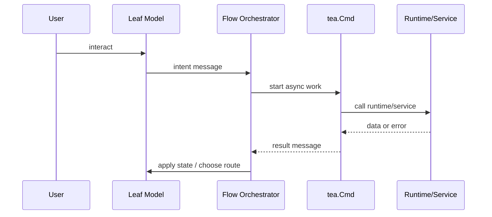

# UI Runtime

This page explains how the Bubble Tea runtime is organized in the rebuilt app.

The TUI is not one giant model. It is a stack of focused models with explicit
ownership boundaries.

## The core split

The UI has three levels of responsibility:

1. root shell
2. flow or page orchestrators
3. leaf interaction models

You can see that split in:

- [`internal/interfaces/tui/root`](../../internal/interfaces/tui/root)
- [`internal/interfaces/tui/screens/onboarding`](../../internal/interfaces/tui/screens/onboarding)
- leaf step packages under
  [`internal/interfaces/tui/screens/onboarding`](../../internal/interfaces/tui/screens/onboarding)

## Root responsibilities

The root model owns shell behavior only:

- top-level composition,
- global quit behavior,
- viewport sizing,
- shared chrome slots such as header and footer,
- forwarding messages into the active page model.

The root should not micromanage onboarding or other feature internals.

## Orchestrator responsibilities

Flow or page orchestrators own:

- route selection within the flow,
- runtime calls,
- async command/result handling,
- applying runtime state back into child models,
- deciding which child is active.

In onboarding, the orchestrator is the feature model in
[`screens/onboarding/model.go`](../../internal/interfaces/tui/screens/onboarding/model.go).

This model is allowed to know about runtime and progression.
Leaf models are not.

## Leaf model responsibilities

Leaf models own local interaction state only:

- highlighted option,
- active input field,
- local draft text,
- local widget-specific help bindings,
- conversion of local interaction into typed intent messages.

Leaf models should not:

- call network or database code directly,
- decide global route changes,
- know about sibling models,
- know about shell layout.

## The command/result loop

All async work follows the same pattern:

1. user interaction produces a typed intent message,
2. the parent or orchestrator handles that intent,
3. external work runs in a `tea.Cmd`,
4. the result comes back as a typed message,
5. the parent applies new state and routes again.

That is the only pattern that scales in Bubble Tea without becoming brittle.

## Parent and child boundaries

The parent model owns:

- active child selection,
- parent-scoped state,
- forwarding unknown messages to the active child,
- lifting child messages into flow-level intent.

The child model owns:

- its own local state,
- its own key bindings,
- rendering its own content,
- emitting semantic intent messages.

This boundary matters because it prevents sibling coupling and keeps each model
small enough to reason about.

## What the UI must never do

- put business truth in widget state
- perform blocking I/O in `View`
- perform blocking I/O directly in synchronous `Update`
- let children call runtimes or infrastructure directly
- hide ownership of route changes or lifecycle transitions

If one of those happens, the architecture is already drifting.

## Failure patterns to watch for

When this model is wrong, the symptoms are usually obvious:

- parent models grow large because children emit mechanical widget events,
- sibling models become coupled through shared parent state hacks,
- loading and error handling becomes inconsistent because children start doing
  their own I/O,
- route changes become hard to reason about because no single model owns them.

The right fix is to restore ownership boundaries, not to add more special-case
message handling.

## Fast code entry points

- [`internal/interfaces/tui/root`](../../internal/interfaces/tui/root)
- [`internal/interfaces/tui/screens/onboarding`](../../internal/interfaces/tui/screens/onboarding)
- [`internal/interfaces/tui/components`](../../internal/interfaces/tui/components)

## Read with these docs

This page describes model ownership.

Read [ui-messages.md](ui-messages.md) for how models communicate.

Read [ui-layout.md](ui-layout.md) for how rendering responsibility is split
between root, chrome, and screens.
