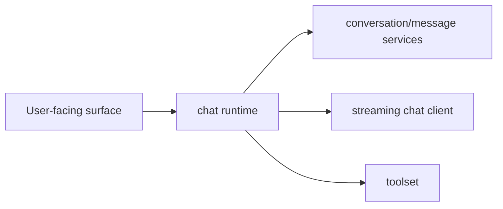

# Chat

Chat is the most lifecycle-sensitive product area in this repository.

The user experience looks simple, but the implementation has to keep
conversation history, local persistence, streaming state, cancellation, and
tool execution coherent across a long-lived session.

## Why this domain is separate

The expensive chat bugs are not visual. They are semantic:

- sending a message twice,
- appending streamed output to the wrong turn,
- persisting incomplete assistant output incorrectly,
- letting tool execution escape the current round,
- leaving the runtime stuck in a streaming state after cancellation or failure.

Those are runtime and domain problems, not just UI problems.

## The current model

The rebuilt chat stack is split into three layers:

1. domain storage contracts
   [`internal/domains/chat`](../../internal/domains/chat) owns typed
   conversation/message operations and local persistence boundaries.
2. chat runtime
   [`internal/runtime/chat`](../../internal/runtime/chat) owns send/cancel,
   stream accumulation, state publication, tool dispatch, and persistence
   sequencing.
3. transport client
   [`internal/infrastructure/chat`](../../internal/infrastructure/chat) owns
   the remote streaming protocol.

## What the domain contracts protect

The domain layer keeps chat state explicit:

- conversations are created and listed through typed operations in
  [`conversations.go`](../../internal/domains/chat/conversations.go),
- user messages are created through validated input in
  [`messages.go`](../../internal/domains/chat/messages.go),
- local adapters under `internal/domains/chat/*_local.go` keep persistence
  behavior behind domain contracts,
- tool definitions under [`internal/domains/chat/tools`](../../internal/domains/chat/tools)
  stay separate from transport/runtime wiring.

That split matters because chat history should be testable without a running UI
or live stream.

## What the runtime owns

The runtime in [`internal/runtime/chat`](../../internal/runtime/chat) is the
source of truth for round lifecycle:

- whether a send is allowed,
- whether a stream is active,
- how streamed events are accumulated,
- when state updates are published,
- when cancellation is legal,
- when data is persisted.

If a chat bug depends on timing, ordering, or cancellation, start in runtime
before touching presentation code.

## What must stay true

- one round owns one stream lifecycle at a time,
- the runtime is the authority for `CanSend`, `Streaming`, and cancellation
  state,
- persistence happens through domain services, not ad hoc transport callbacks,
- tools execute through an explicit toolset boundary,
- transport events re-enter through runtime state transitions instead of
  mutating UI state directly.

## Failure behavior

The useful way to debug chat failures is by class:

- if the wrong text is stored, inspect runtime persistence sequencing,
- if sends overlap, inspect runtime readiness checks,
- if stream output is malformed, inspect the infrastructure chat client,
- if tool behavior is wrong, inspect the toolset contract before changing
  runtime state code.

Do not patch chat issues purely in the UI unless the bug is truly rendering-only.

## Current product reality

The runtime and domain layers are present now, but the rebuilt TUI chat surface
is still intentionally minimal compared with onboarding. That means the domain
model here is ahead of the final interface polish, which is fine. The important
thing is that the lifecycle and persistence contracts are already explicit.

## Code entry points

- [`internal/domains/chat/conversations.go`](../../internal/domains/chat/conversations.go)
- [`internal/domains/chat/messages.go`](../../internal/domains/chat/messages.go)
- [`internal/domains/chat/tools`](../../internal/domains/chat/tools)
- [`internal/runtime/chat/runtime.go`](../../internal/runtime/chat/runtime.go)
- [`internal/runtime/chat/send.go`](../../internal/runtime/chat/send.go)
- [`internal/runtime/chat/stream.go`](../../internal/runtime/chat/stream.go)
- [`internal/infrastructure/chat`](../../internal/infrastructure/chat)
