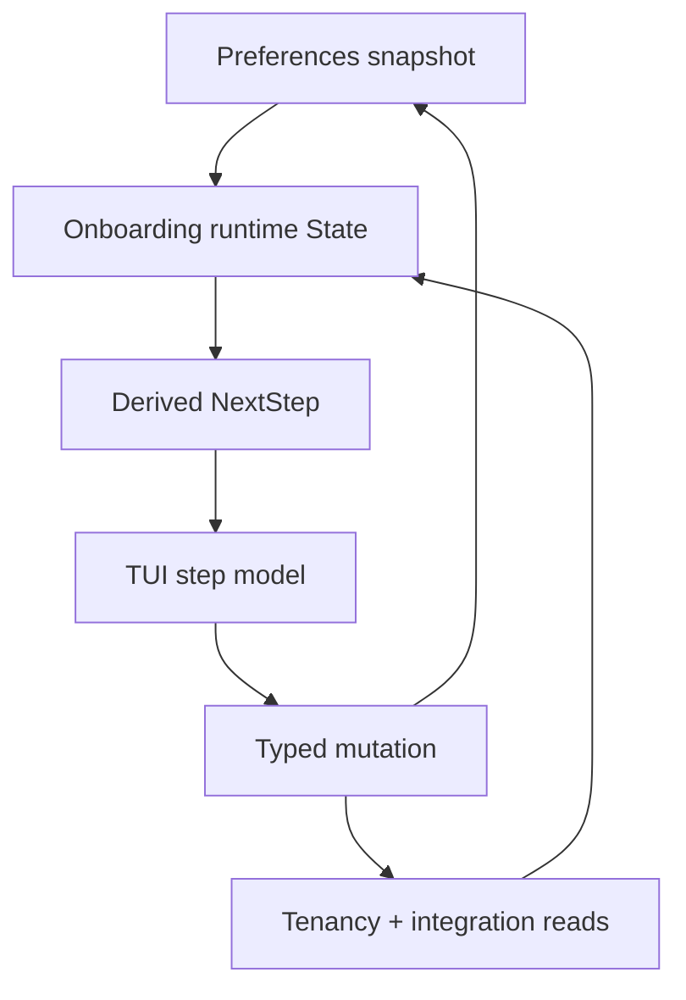

# Onboarding Bootstrap

Onboarding is the bootstrap runtime that gets a user from "authenticated" to
"account-scoped runtime can safely start."

The important model is that onboarding is not a linear wizard. It is a
deterministic projection over preferences, remote tenancy state, Datadog
integration state, and PowerSync readiness.

## Why this flow exists

Before account scope is known and runtime is running, the app cannot rely on
local projection as the main source of truth. So onboarding is deliberately
API-first and projection-driven.

That split protects two things:

- bootstrap can work before SQLite and PowerSync are active,
- progression stays correct even when the user restarts, refreshes, or partially
  completes the flow.

## The mental model

The current onboarding runtime is easiest to understand as four parts:

1. preferences snapshot
   Persisted role and scope hints from [`internal/domains/preferences`](../../internal/domains/preferences).
2. remote state loaders
   Tenancy and integration reads from [`internal/domains/tenancy`](../../internal/domains/tenancy)
   and [`internal/domains/integrations`](../../internal/domains/integrations).
3. onboarding projection
   [`internal/runtime/onboarding`](../../internal/runtime/onboarding) loads
   current truth into one `State` and derives `NextStep`.
4. TUI orchestration
   [`internal/interfaces/tui/screens/onboarding`](../../internal/interfaces/tui/screens/onboarding)
   renders the current step and turns user intent into typed runtime calls.

## What progression actually depends on

The onboarding runtime state in
[`internal/runtime/onboarding/state.go`](../../internal/runtime/onboarding/state.go)
tracks:

- selected role,
- known organizations/accounts/workspaces,
- the currently selected organization/account/workspace,
- Datadog account and readiness state,
- in-progress Datadog draft state,
- PowerSync readiness,
- the derived `NextStep`.

That means the TUI should not infer progression from local widget state. It
should always re-apply runtime state and let the runtime choose the next step.

## What must stay true

- onboarding progression is derived from runtime state, not from screen-local
  assumptions,
- typed domain inputs validate user intent before remote mutations execute,
- selection state in preferences is explicit and scope-safe,
- session startup happens only after onboarding has enough scoped state to call
  [`internal/runtime/session`](../../internal/runtime/session) safely,
- PowerSync readiness is treated as a real gate, not cosmetic status.

## Failure behavior

When onboarding fails, the important question is where truth drifted:

- if the wrong step appears, check runtime projection before touching the UI,
- if a mutation succeeds but the UI stays stale, the bug is usually missing
  reprojection or a remote contract mismatch,
- if scope feels inconsistent, check preferences updates and selection resets,
- if onboarding stalls at the sync step, inspect session ensure/readiness
  boundaries instead of step rendering first.

The correct recovery pattern is to re-read and re-project. Do not patch around
stale UI state with local step-specific flags.

## Code entry points

- [`internal/runtime/onboarding/service.go`](../../internal/runtime/onboarding/service.go)
- [`internal/runtime/onboarding/load_state.go`](../../internal/runtime/onboarding/load_state.go)
- [`internal/runtime/onboarding/progression.go`](../../internal/runtime/onboarding/progression.go)
- [`internal/interfaces/tui/screens/onboarding/model.go`](../../internal/interfaces/tui/screens/onboarding/model.go)
- [`internal/runtime/session/service.go`](../../internal/runtime/session/service.go)
